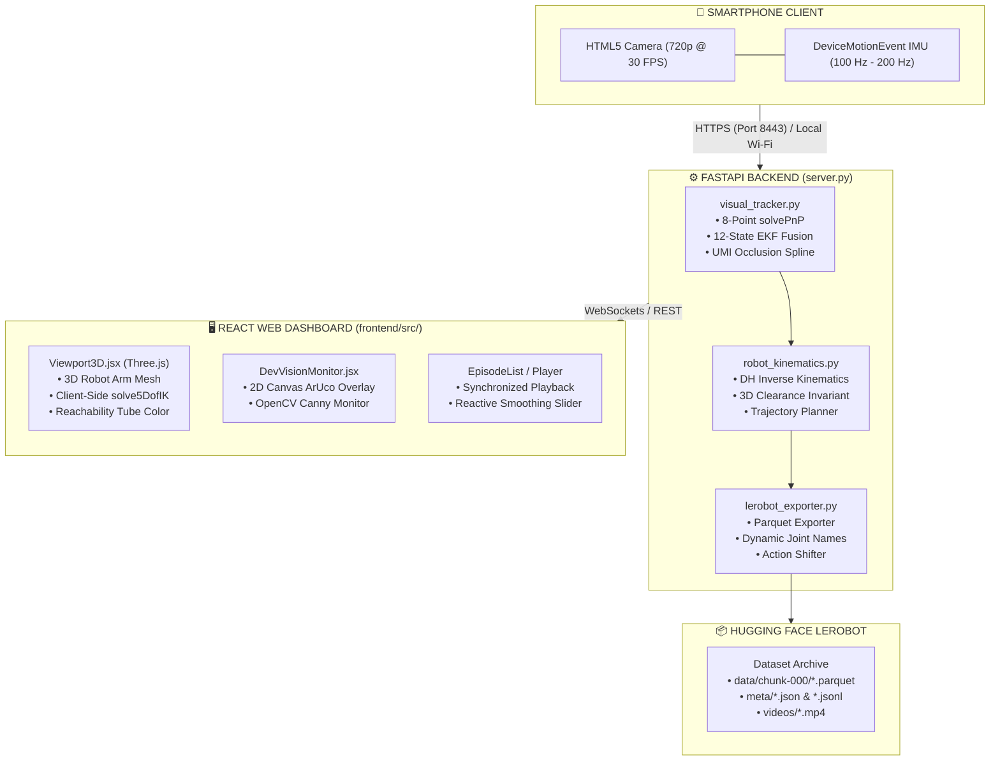

# CONTINUITY.md — Mobile Dataset Collector

**Last Updated:** 2026-09-11  
**Project Version:** v2.0  
**Target Robots:** SO-ARM101-OMNI-KIN (default), SO-ARM101, SO-ARM100, and generic 5–6 DOF URDFs.  
**Repository:** `https://github.com/FalightSK/omni-kin.git`

This document serves as the technical handover, architecture specification, and contributor reference for developers, robotics engineers, and researchers maintaining or extending the **OmniKin Mobile Dataset Collector**.

---

## 📑 Table of Contents

1. [System Architectural Overview](#1-system-architectural-overview)
2. [Mathematical Foundations & Algorithms](#2-mathematical-foundations--algorithms)
   - [A. Over-Determined 8-Point Dual-ArUco PnP](#a-over-determined-8-point-dual-aruco-pnp)
   - [B. 12-State Extended Kalman Filter (EKF) Fusion](#b-12-state-extended-kalman-filter-ekf-fusion)
   - [C. Universal 3D Euclidean Clearance Collision Invariant](#c-universal-3d-euclidean-clearance-collision-invariant)
   - [D. C² Quintic Minimum-Jerk Approach Path Generation](#d-c²-quintic-minimum-jerk-approach-path-generation)
3. [Runtime Concurrency & Server Lifecycle](#3-runtime-concurrency--server-lifecycle)
4. [Kinematics & Dual Solver Architecture](#4-kinematics--dual-solver-architecture)
5. [LeRobot v2.0 Dataset Schema & Invariants](#5-lerobot-v20-dataset-schema--invariants)
6. [Configuration Persistence Model](#6-configuration-persistence-model)
7. [Verification, Testing & Diagnostics](#7-verification-testing--diagnostics)
8. [Roadmap & Future Extensions](#8-roadmap--future-extensions)

---

## 1. System Architectural Overview



---

## 2. Mathematical Foundations & Algorithms

### A. Over-Determined 8-Point Dual-ArUco PnP

Traditional single-marker pose estimation suffers from planar ambiguity (flipping along the normal vector when the viewing angle is near orthogonal to the plane). OmniKin formulates an over-determined 8-point system by rigidly joining:
- **Tag A (Primary Origin Anchor)**: $10.0\text{ cm}$ ArUco marker (`DICT_6X6_250`, ID 0) with bottom-left corner at world coordinate $(0.0, 0.0, 0.0)$.
- **Tag B (Secondary Offset Anchor)**: $5.0\text{ cm}$ ArUco marker (`DICT_6X6_250`, ID 1) with bottom-left corner at $(0.15, 0.0, 0.0)$.

The object corner matrix $\mathbf{P}_{\text{world}} \in \mathbb{R}^{3 \times 8}$ contains:
$$\mathbf{P}_{\text{world}} = \begin{bmatrix}
0 & 0.10 & 0.10 & 0 & 0.15 & 0.20 & 0.20 & 0.15 \\
0 & 0 & 0.10 & 0.10 & 0 & 0 & 0.05 & 0.05 \\
0 & 0 & 0 & 0 & 0 & 0 & 0 & 0
\end{bmatrix}$$

Sub-pixel refinement is applied via `cv2.cornerSubPix`. When both markers are visible, the pose is estimated using Levenberg-Marquardt optimization (`cv2.SOLVEPNP_ITERATIVE`), completely eliminating flip ambiguities.

---

### B. 12-State Extended Kalman Filter (EKF) Fusion

High-frequency phone motion telemetry is processed via a 12-state strapdown EKF:
$$\mathbf{x} = \begin{bmatrix} \mathbf{p} \\ \mathbf{v} \\ \boldsymbol{\theta} \\ \mathbf{b}_a \end{bmatrix} \in \mathbb{R}^{12}$$
Where:
- $\mathbf{p} \in \mathbb{R}^3$: 3D position in ArUco table frame (meters)
- $\mathbf{v} \in \mathbb{R}^3$: 3D velocity in ArUco table frame ($\text{m/s}$)
- $\boldsymbol{\theta} \in \mathbb{R}^3$: Euler orientation angles (Roll, Pitch, Yaw in radians)
- $\mathbf{b}_a \in \mathbb{R}^3$: Accelerometer sensor bias ($\text{m/s}^2$)

#### Kinematic Propagation ($100-200\text{ Hz}$):
$$\mathbf{p}_{k} = \mathbf{p}_{k-1} + \mathbf{v}_{k-1} \Delta t + \frac{1}{2} \mathbf{a}_{\text{world}} \Delta t^2$$
$$\mathbf{v}_{k} = \mathbf{v}_{k-1} + \mathbf{a}_{\text{world}} \Delta t$$
$$\mathbf{a}_{\text{world}} = \mathbf{R}(\boldsymbol{\theta}_{k-1}) (\mathbf{a}_{\text{meas}} - \mathbf{b}_{a, k-1}) - \mathbf{g}$$

#### Adaptive Visual Measurement Covariance:
When visual measurements arrive ($\sim 30\text{ Hz}$), the measurement noise covariance $\mathbf{R}$ dynamically scales based on marker visibility:
- **Both tags visible (8 points)**: $\mathbf{R}_{\text{dual}} = \text{diag}(10^{-3}, 10^{-3}, 10^{-3})$
- **Single tag visible (4 points)**: $\mathbf{R}_{\text{single}} = \text{diag}(4 \times 10^{-3}, 4 \times 10^{-3}, 4 \times 10^{-3})$

---

### C. Universal 3D Euclidean Clearance Collision Invariant

Top-mounted wrist cameras risk crashing into the robot forearm link ($L_3$) during high-elevation or upward-pitch manipulation. Instead of relying on hardcoded joint angle heuristics, OmniKin enforces an analytic 3D Euclidean clearance invariant.

Let $\mathbf{p}_{\text{elbow}}$ and $\mathbf{p}_{\text{wrist}}$ be the 3D Cartesian coordinates of the forearm joint centers, and let $\mathbf{p}_{\text{cam}}$ be the camera optical center. The projection parameter $t^*$ along the forearm segment is:

$$
t^* = \operatorname{clip}\left(\frac{(\mathbf{p}_{\text{cam}} - \mathbf{p}_{\text{elbow}}) \cdot (\mathbf{p}_{\text{wrist}} - \mathbf{p}_{\text{elbow}})}{\|\mathbf{p}_{\text{wrist}} - \mathbf{p}_{\text{elbow}}\|^2}, 0, 1\right)
$$

The closest point on the forearm link is:

$$
\mathbf{p}_{\text{closest}} = \mathbf{p}_{\text{elbow}} + t^* (\mathbf{p}_{\text{wrist}} - \mathbf{p}_{\text{elbow}})
$$

$$
d_{\text{clearance}} = \|\mathbf{p}_{\text{cam}} - \mathbf{p}_{\text{closest}}\|
$$

- If $d_{\text{clearance}} < 0.045\text{ m}$ ($4.5\text{ cm}$), the candidate is penalized with cost:
  $$\Phi_{\text{clearance}} = 800 \cdot (0.045 - d_{\text{clearance}})^2$$
- This mathematical invariant is coordinate-free and functions identically across any robot embodiment, DH parameterization, or mounting bracket geometry.

---

### D. C² Quintic Minimum-Jerk Approach Path Generation

For policy fine-tuning (`initial_aware` mode), the robot must start from a standardized home pose and transition smoothly to the first demonstration waypoint. OmniKin uses a $C^2$ quintic polynomial blend:
$$s(\tau) = 10\tau^3 - 15\tau^4 + 6\tau^5, \quad \tau \in [0, 1]$$
Properties:
- $s(0) = 0, \quad s(1) = 1$
- $\dot{s}(0) = \dot{s}(1) = 0$ (Zero starting and ending velocity)
- $\ddot{s}(0) = \ddot{s}(1) = 0$ (Zero starting and ending acceleration)

#### Parabolic Table Lift Arc:
To prevent dragging across the table surface or colliding with workspace objects, the vertical height $z(\tau)$ incorporates a parabolic elevation arc:
$$z(\tau) = (1 - s(\tau)) z_{\text{home}} + s(\tau) z_{\text{start}} + 4 \Delta z_{\text{lift}} \tau (1 - \tau)$$
Where $\Delta z_{\text{lift}} = 0.06\text{ m}$ ($6\text{ cm}$).

---

## 3. Runtime Concurrency & Server Lifecycle

`server.py` manages dual network servers simultaneously:
1. **HTTP Server (`http://0.0.0.0:8000`)**: Runs in the main thread. Serves desktop WebGL UI, static assets, and REST APIs.
2. **HTTPS Server (`https://0.0.0.0:8443`)**: Runs in a background daemon thread (`threading.Thread`). Uses bundled `cert.pem` and `key.pem` to provide SSL encryption required by mobile browsers for camera and sensor APIs.

### Singleton Modules in `server.py`:
- `ROBOT_CONFIG`: Global dictionary synchronized with `robot_config.json`.
- `workspace_calibrator`: Transforms coordinates between ArUco table frame and Robot base frame.
- `camera_gripper_calibrator`: Transforms coordinates between Camera lens and Gripper TCP.
- `trajectory_planner`: Computes quintic approach splines.
- `lerobot_exporter`: Manages Parquet serialization and video transcoding.

---

## 4. Kinematics & Dual Solver Architecture

To deliver zero-latency interactive 3D rendering alongside high-precision dataset generation, OmniKin implements twin inverse kinematics solvers:

| Dimension | Python Solver (`robot_kinematics.py`) | JavaScript Solver (`Viewport3D.jsx`) |
| :--- | :--- | :--- |
| **Execution** | Server-side (FastAPI / Exporter) | Client-side (Three.js render loop) |
| **Algorithm** | Best-of-N Candidate Search + Numerical Refinement | Analytic Geometric 5-DOF IK with Pitch Prior |
| **Clearance** | Vectorized 3D Euclidean point-to-segment | Analytic 3D clearance evaluation per candidate |
| **Wrist Index** | Dynamically discovered via `find_wrist_pitch_index` | Mirror of server-discovered `wrist_pitch_idx` |
| **Purpose** | High-precision dataset export and API responses | 60 FPS real-time interactive arm visualization |

---

## 5. LeRobot v2.0 Dataset Schema & Invariants

Datasets exported via `lerobot_exporter.py` strictly adhere to the Hugging Face LeRobot v2.0 / v2.1 specifications.

### Mandatory Invariants (Verified via Unit Tests)
1. **Action Horizon Shifting**:
   $$\mathbf{a}_t = \mathbf{q}_{t+1} \quad \forall t \in [0, T-2]$$
   $$\mathbf{a}_{T-1} = \mathbf{q}_{T-1} \quad (\text{terminal replication})$$
2. **Episode Termination**:
   `next.done` is `True` strictly on frame $T-1$, and `False` on all preceding frames.
3. **Sequential Indexing**:
   `episode_index` is strictly 0-based and monotonic. `frame_index` strictly resets to $0$ on episode transitions. `index` is globally monotonic across the entire dataset.
4. **Dynamic Joint Naming**:
   Joint names declared in `info.json` under `features["observation.state"]["names"]` and `features["action"]["names"]` are dynamically derived from the active robot's DH table (e.g. `["base_yaw_joint", "shoulder_pitch_joint", ..., "gripper"]`) rather than hardcoded strings.
5. **Float32 Precision Alignment**:
   All state and action arrays are cast to `float32` to guarantee exact dtype matching with PyTorch / LeRobot tensors.

---

## 6. Configuration Persistence Model

All user calibrations are persisted to `robot_config.json`. On server boot, `load_robot_config()` loads the file and falls back to safe defaults for any missing keys:

```json
{
  "robot_type": "so_arm101_omni_kin",
  "offset_x": 0.091,
  "offset_y": -0.410,
  "offset_z": 0.000,
  "yaw_deg": 90.0,
  "q3_safe_max_deg": 5.0,
  "gripper_offset": {
    "forward_cm": 12.8,
    "height_cm": 10.9,
    "lateral_cm": 0.0,
    "pitch_deg": 40.4,
    "roll_deg": 0.0,
    "yaw_deg": 0.0,
    "enabled": true
  },
  "initial_position": {
    "x": 0.15,
    "y": 0.00,
    "z": 0.20,
    "pitch_deg": 0.0,
    "roll_deg": 0.0,
    "yaw_deg": 0.0,
    "gripper": 100.0,
    "enabled": true
  }
}
```

---

## 7. Verification, Testing & Diagnostics

### Test Suite Execution
```bash
# 1. Dual-ArUco PnP & EKF Sensor Fusion Test
python test_aruco_pipeline.py

# 2. Universal Multi-Embodiment Kinematics & Clearance Test
python test_robot_kinematics.py

# 3. URDF Parser & DH Parameter Extraction Test
python test_urdf_converter.py

# 4. LeRobot Exporter Schema & Parquet Test
python test_pipeline.py
```

---

## 8. Roadmap & Future Extensions

1. **H.264 Hardware-Accelerated Video Transcoding**:
   - Currently, exported video chunks use OpenCV's `mp4v` fourcc. Integrating an automated `ffmpeg` background worker with `libx264` will enable instant in-browser playback across all platforms.
2. **Analytic 6-DOF / 7-DOF Kinematics Solvers**:
   - Extend the analytic solver from 5-DOF + Gripper to general 6-DOF (spherical wrist) and 7-DOF (redundancy resolution) arms like Franka Emika Panda and UR5e.
3. **Live Closed-Loop Policy Evaluation**:
   - Add a WebSocket streaming endpoint enabling a trained LeRobot model running on a GPU workstation to command the virtual 3D arm in real time from live phone video feed.
