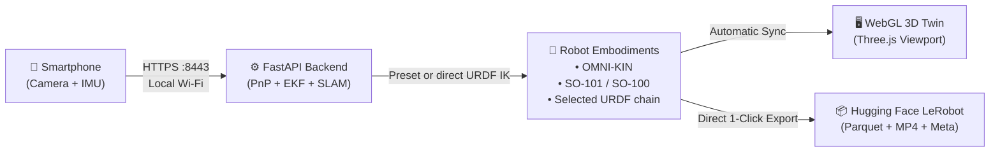
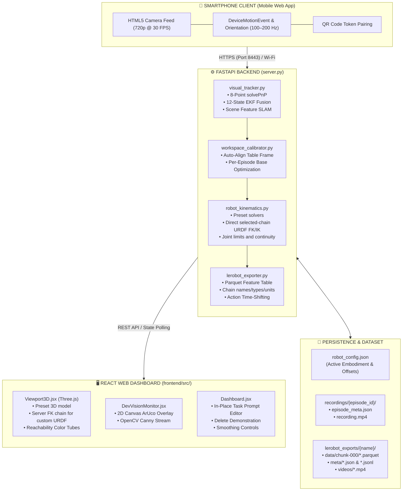

# CONTINUITY.md — OmniKin Mobile Dataset Collector
<br>
**Last Updated:** 2026-09-23<br>
**Project Version:** v2.2 (Multi-Embodiment & Custom URDF Auto-Recalculation Release)<br>
**Target Robots:** SO-ARM101-OMNI-KIN (default), SO-ARM101, SO-ARM100, and custom serial URDF chains with selected base/TCP links<br>
**Target Imitation Learning Policies:** ACT (Action Chunking with Transformers), Diffusion Policy (DP), Flow Matching (LeRobot v2.0+)<br>
**Repository:** `https://github.com/FalightSK/omni-kin.git`<br>
**Primary Tech Stack:** Python 3.10, FastAPI, OpenCV, NumPy, SciPy, Pandas, PyArrow, React 18, Vite, Three.js, Tailwind CSS<br>

---

## 📑 Table of Contents

1. [Executive Summary & The Big Idea](#1-executive-summary--the-big-idea)
2. [Current Progress & Codebase State](#2-current-progress--codebase-state)
3. [System Architectural Overview](#3-system-architectural-overview)
4. [Mathematical Foundations & Algorithms](#4-mathematical-foundations--algorithms)
   - [A. Over-Determined 8-Point Dual-ArUco PnP](#a-over-determined-8-point-dual-aruco-pnp)
   - [B. 12-State Extended Kalman Filter & Virtual SLAM Recovery](#b-12-state-extended-kalman-filter--virtual-slam-recovery)
   - [C. Preset 3D Euclidean Clearance Heuristic](#c-preset-3d-euclidean-clearance-heuristic)
   - [D. C² Quintic Minimum-Jerk MoveJ Approach Path](#d-c²-quintic-minimum-jerk-movej-approach-path)
5. [Multi-Embodiment & Custom URDF Engine](#5-multi-embodiment--custom-urdf-engine)
6. [Per-Episode Independent Base Optimization](#6-per-episode-independent-base-optimization)
7. [Demonstration Lifecycle & Windows File System Robustness](#7-demonstration-lifecycle--windows-file-system-robustness)
8. [LeRobot Dataset Schema & Verification Invariants](#8-lerobot-dataset-schema--verification-invariants)
9. [Codebase Map & Key Components](#9-codebase-map--key-components)
10. [Configuration Persistence Model (`robot_config.json`)](#10-configuration-persistence-model)
11. [Verification Suite & Inspection Evidence](#11-verification-suite--inspection-evidence)
12. [Project Goals & Developer Roadmap](#12-project-goals--developer-roadmap)

---

## 1. Executive Summary & The Big Idea

### The Problem in Robot Imitation Learning
Training robust visuomotor policies (such as ACT or Diffusion Policy) requires hundreds or thousands of high-quality, real-world demonstrations. Traditionally, collecting this data requires:
- **Expensive teleoperation hardware**: Leader-follower puppet arms costing $3,000–$10,000 per setup.
- **Bulky equipment**: VR headsets, SteamVR tracking lighthouses, or external OptiTrack motion capture rigs.
- **Embodiment lock-in**: Demonstrations recorded on one puppet arm cannot easily be transferred to robots with different limb lengths, joint offsets, or base mount geometries.

### The OmniKin Solution
**OmniKin turns any consumer smartphone into a high-precision robot data collector.** By attaching a smartphone to a handheld 3D-printed gripper tool over an inexpensive printed paper Dual-ArUco mat:
1. The phone records 720p/30 FPS video and 100–200 Hz IMU sensor data.
2. The backend tracks the 6-DOF Cartesian gripper trajectory using an over-determined 8-point PnP solver fused with a 12-state Extended Kalman Filter (EKF) and virtual visual SLAM landmark recovery.
3. The server translates Cartesian end-effector waypoints into joint values for presets and custom chains using their ordered URDF paths directly.
4. The user inspects demonstrations in a 3D WebGL digital twin with reachability diagnostics and exports the dataset directly into the standard **Hugging Face LeRobot** format.


```mermaid
flowchart LR
    Phone["📱 Smartphone<br/>(Camera + IMU)"] -->|"HTTPS :8443<br/>Local Wi-Fi"| Server["⚙️ FastAPI Backend<br/>(PnP + EKF + SLAM)"]
    Server -->|"Preset or direct URDF IK"| Embodiments["🦾 Robot Embodiments<br/>• OMNI-KIN<br/>• SO-101 / SO-100<br/>• Selected URDF chain"]
    Embodiments -->|"Automatic Sync"| WebGL["🖥️ WebGL 3D Twin<br/>(Three.js Viewport)"]
    Embodiments -->|"Direct 1-Click Export"| LeRobot["📦 Hugging Face LeRobot<br/>(Parquet + MP4 + Meta)"]
```

---

## 2. Current Progress & Codebase State

As of September 2026, the codebase has reached full end-to-end maturity:

| Capability | Status | Implementation Details |
| :--- | :---: | :--- |
| **Phone Logger PWA** | ✅ Completed | Mobile web app with camera streaming, IMU orientation/acceleration capture, and ArUco pairing via QR code. |
| **Optical & Inertial Tracking** | ✅ Completed | Over-determined 8-point dual-marker PnP, 12-state strapdown EKF, and fallback virtual scene SLAM. |
| **Built-in Robot Presets** | ✅ Completed | SO-ARM101-OMNI-KIN (default), SO-101, and SO-100 use their packaged URDF chains with joint limit enforcement. |
| **Custom URDF Upload & Direct Chain Kinematics** | ✅ Completed | Presets and custom models use ordered base-to-TCP URDF joint origins, axes, types, and limits. |
| **Auto-Recalculation on URDF Change** | ✅ Completed | Applying a new URDF triggers instant re-solving of joint states and actions for all existing episodes. |
| **Per-Episode Base Optimization** | ✅ Completed | Independent optimal base coordinates ($x, y, z, \text{yaw}$) computed per demo to maximize manipulability. |
| **Interactive 3D Dashboard** | ✅ Completed | Dual-pane video/3D viewer, reachability coloring, in-place task prompt editor, Dev View diagnostics. |
| **Demonstration Deletion** | ✅ Completed | Windows-safe directory deletion (`_safe_rmtree`), string ID support, and contiguous re-indexing. |
| **LeRobot v2.1 Exporter** | ✅ Completed | Parquet tabular dataset, standardized MP4 chunks, and joint type/unit metadata for selected URDF chains. |
| **Dual Trajectory Modes** | ✅ Completed | `free_form` for unconstrained pretraining; `initial_aware` with $C^2$ MoveJ approach path for fine-tuning. |
| **Automated Verification Suite** | ✅ Completed | Backend tests cover URDF math, parser/API behavior, episode sync, tracking, and exports. |

---

## 3. System Architectural Overview


```mermaid
flowchart TD
    subgraph Client["📱 SMARTPHONE CLIENT (Mobile Web App)"]
        Cam["HTML5 Camera Feed (720p @ 30 FPS)"]
        IMU["DeviceMotionEvent & Orientation (100–200 Hz)"]
        QR["QR Code Token Pairing"]
        Cam --- IMU --- QR
    end

    subgraph Backend["⚙️ FASTAPI BACKEND (server.py)"]
        direction TB
        VT["visual_tracker.py<br/>• 8-Point solvePnP<br/>• 12-State EKF Fusion<br/>• Scene Feature SLAM"]
        RK["robot_kinematics.py<br/>• Preset solvers<br/>• Direct selected-chain URDF FK/IK<br/>• Joint limits and continuity"]
        WC["workspace_calibrator.py<br/>• Auto-Align Table Frame<br/>• Per-Episode Base Optimization"]
        LE["lerobot_exporter.py<br/>• Parquet Feature Table<br/>• Chain names/types/units<br/>• Action Time-Shifting"]
        VT --> WC --> RK --> LE
    end

    subgraph Dashboard["🖥️ REACT WEB DASHBOARD (frontend/src/)"]
        direction TB
        V3D["Viewport3D.jsx (Three.js)<br/>• Preset 3D model<br/>• Server FK chain for custom URDF<br/>• Reachability Color Tubes"]
        DVM["DevVisionMonitor.jsx<br/>• 2D Canvas ArUco Overlay<br/>• OpenCV Canny Stream"]
        Ctrl["Dashboard.jsx<br/>• In-Place Task Prompt Editor<br/>• Delete Demonstration<br/>• Smoothing Controls"]
    end

    subgraph Storage["💾 PERSISTENCE & DATASET"]
        Cfg["robot_config.json<br/>(Active Embodiment & Offsets)"]
        Rec["recordings/{episode_id}/<br/>• episode_meta.json<br/>• recording.mp4"]
        Exp["lerobot_exports/{name}/<br/>• data/chunk-000/*.parquet<br/>• meta/*.json & *.jsonl<br/>• videos/*.mp4"]
    end

    Client -- "HTTPS (Port 8443) / Wi-Fi" --> Backend
    Backend -- "REST API / State Polling" --> Dashboard
    Backend <--> Storage
```

---

## 4. Mathematical Foundations & Algorithms

### A. Over-Determined 8-Point Dual-ArUco PnP
Single square planar markers exhibit normal-vector flip ambiguity when viewed near-orthogonally. OmniKin eliminates this by rigidly coupling two markers with known metric geometry:
- **Tag A (World Origin)**: $10.0\text{ cm}$ square ArUco marker (`DICT_6X6_250`, ID 0), bottom-left at $(0.0, 0.0, 0.0)\,\text{m}$.
- **Tag B (Baseline Offset)**: $5.0\text{ cm}$ square ArUco marker (`DICT_6X6_250`, ID 1), bottom-left at $(0.15, 0.0, 0.0)\,\text{m}$.

The 8 object corners form a non-symmetric 3D constellation:
$$\mathbf{P}_{\text{world}} = \begin{bmatrix}
0.00 & 0.10 & 0.10 & 0.00 & 0.15 & 0.20 & 0.20 & 0.15 \\
0.00 & 0.00 & 0.10 & 0.10 & 0.00 & 0.00 & 0.05 & 0.05 \\
0.00 & 0.00 & 0.00 & 0.00 & 0.00 & 0.00 & 0.00 & 0.00
\end{bmatrix}$$

Corners are detected with sub-pixel refinement (`cv2.cornerSubPix`) and solved with Levenberg-Marquardt optimization (`cv2.SOLVEPNP_ITERATIVE`), achieving sub-millimeter positional precision.

---

### B. 12-State Extended Kalman Filter & Virtual SLAM Recovery
High-frequency phone motion is filtered using a 12-state continuous-discrete strapdown EKF:
$$\mathbf{x} = \begin{bmatrix} \mathbf{p} & \mathbf{v} & \boldsymbol{\theta} & \mathbf{b}_a \end{bmatrix}^T \in \mathbb{R}^{12}$$
- $\mathbf{p} \in \mathbb{R}^3$: Position in table frame (meters).
- $\mathbf{v} \in \mathbb{R}^3$: Linear velocity (m/s).
- $\boldsymbol{\theta} \in \mathbb{R}^3$: Roll, pitch, yaw orientation (radians).
- $\mathbf{b}_a \in \mathbb{R}^3$: Accelerometer bias drift ($m/\text{s}^2$).

#### Kinematic Propagation ($100–200\text{ Hz}$):
$$\mathbf{p}_k = \mathbf{p}_{k-1} + \mathbf{v}_{k-1} \Delta t + \frac{1}{2} \mathbf{a}_{\text{world}} \Delta t^2, \quad \mathbf{v}_k = \mathbf{v}_{k-1} + \mathbf{a}_{\text{world}} \Delta t$$
$$\mathbf{a}_{\text{world}} = \mathbf{R}(\boldsymbol{\theta}_{k-1}) (\mathbf{a}_{\text{meas}} - \mathbf{b}_{a, k-1}) - \mathbf{g}$$

#### Virtual SLAM Landmark Recovery (UMI-Style):
When the operator's hand or physical objects occlude the ArUco board, the tracker falls back to 3D scene landmarks pinned during periods of marker visibility:
1. PnP is continuously evaluated against FAST/ORB scene keypoints.
2. If markers disappear, tracked 3D scene features maintain continuous table-anchored tracking without origin jump.

---

### C. Preset 3D Euclidean Clearance Heuristic
When a camera phone is mounted on top of the gripper, upward wrist pitch can cause the phone casing to crash into the robot's forearm link. OmniKin implements a coordinate-free 3D Euclidean segment distance invariant:

Let $\mathbf{p}_{\text{elbow}}$ and $\mathbf{p}_{\text{wrist}}$ be the 3D joint centers of the forearm segment, and let $\mathbf{p}_{\text{cam}}$ be the camera center. The projection factor $t^*$ is:
$$t^* = \text{clip}\left(\frac{(\mathbf{p}_{\text{cam}} - \mathbf{p}_{\text{elbow}}) \cdot (\mathbf{p}_{\text{wrist}} - \mathbf{p}_{\text{elbow}})}{\|\mathbf{p}_{\text{wrist}} - \mathbf{p}_{\text{elbow}}\|^2}, 0, 1\right)$$
$$\mathbf{p}_{\text{closest}} = \mathbf{p}_{\text{elbow}} + t^* (\mathbf{p}_{\text{wrist}} - \mathbf{p}_{\text{elbow}}), \quad d_{\text{clearance}} = \|\mathbf{p}_{\text{cam}} - \mathbf{p}_{\text{closest}}\|$$

- If $d_{\text{clearance}} < 0.045\text{ m}$ ($4.5\text{ cm}$), the candidate is penalized:
  $$\Phi_{\text{clearance}} = 800 \cdot (0.045 - d_{\text{clearance}})^2$$
- This clearance heuristic applies to the built-in preset geometry. Custom URDF collision geometry and physical robot contact are not simulated; physically inspect clearances before hardware use.

---

### D. C² Quintic Minimum-Jerk MoveJ Approach Path
For fine-tuning (`initial_aware` mode), demonstrations must seamlessly connect the robot's canonical home standby position to the first recorded waypoint without jerk or velocity discontinuity. OmniKin generates a smooth $C^2$ quintic polynomial:
$$s(\tau) = 10\tau^3 - 15\tau^4 + 6\tau^5, \quad \tau \in [0, 1]$$
Boundary conditions:
$$s(0) = 0, \quad s(1) = 1, \quad \dot{s}(0) = \dot{s}(1) = 0, \quad \ddot{s}(0) = \ddot{s}(1) = 0$$

#### Parabolic Table Lift Arc:
To prevent dragging across table clutter, elevation $z(\tau)$ incorporates a quadratic lift:
$$z(\tau) = (1 - s(\tau)) z_{\text{home}} + s(\tau) z_{\text{start}} + 4 \Delta z_{\text{lift}} \tau (1 - \tau), \quad \Delta z_{\text{lift}} = 0.06\text{ m}$$

---

## 5. Multi-Embodiment & Custom URDF Engine

OmniKin runs both built-in presets and custom robots through direct base-to-TCP URDF chains. Kinematics, preview, and exports use joint origins and axes from those paths:

### Built-in Presets
- `so_arm101_omni_kin`: Base `base`, TCP `gripper_base`.
- `so101`: Base `base_link`, TCP `gripper_base`.
- `so100`: Base `base_link`, TCP `gripper_base`.

### Custom URDF Pipeline
Custom serial URDF chains are configured by choosing a base link and a TCP link:
1. **Path validation** checks named links, supported joint types, finite origins, non-zero movable axes, limits, and a unique selected path. Mimic joints inside the selected arm path are rejected.
2. **Direct forward kinematics** composes each joint's parent-to-joint origin transform with that joint's rotation or translation. Fixed joints remain in the path. Revolute/continuous state values are degrees at the dataset boundary; prismatic values are meters.
3. **Bounded inverse kinematics** optimizes every movable joint on the selected path, respects URDF position limits, and uses the previous solution to maintain continuity. Smoothing follows URDF velocity limits when present.
4. **Automatic recalculation**: `/api/robot/urdf/apply` stores the raw URDF and selectors, then refreshes episode joint trajectories, FK link positions, preview, and actions.
5. **Export metadata** records the selected base/TCP, joint names, types, units, and ordered joint chain. The normalized gripper channel stays separate. Initial-aware custom approach duration is extended as needed to respect URDF joint velocity limits.

---

## 6. Per-Episode Independent Base Optimization

Because human manipulation demonstrations occur in different regions of the workspace (e.g., reaching far left vs. stacking objects close to the center), a single global robot base coordinate can cause unnecessary out-of-reach singularities or awkward joint limits.

OmniKin provides **Per-Episode Independent Base Optimization**:
- The calibrator runs `WorkspaceCalibrator.find_optimal_base_position(poses)` for each episode independently.
- The optimizer maximizes the Cartesian reachability margin and minimizes joint effort.
- Stored directly in `episode['workspace_calibration']`.
- The user can toggle between `optimal` and a saved `preset` in the 3D viewport.
- During export, `lerobot_exporter.py` automatically checks if an episode has an independent calibration and evaluates inverse kinematics accordingly.

---

## 7. Demonstration Lifecycle & Windows File System Robustness

Recorded demonstrations are managed through a robust lifecycle:

### Demonstration Editing & Playback
- **In-Place Task Prompt Editing**: Task instructions (e.g., `"pick the red block"`) can be edited directly on the timeline or sidebar and saved instantly via `/api/episodes/{episode_id}/task`.
- **Synchronized Scrubbing**: The 3D viewport, 2D camera inset, and OpenCV Dev View are locked to the same frame slider index.

### Windows-Safe Episode Deletion
Deleting episodes on Windows often crashes standard Python scripts due to locked file handles (from OpenCV video capture) or read-only file attributes. OmniKin implements:
1. **`_safe_rmtree(path)`**:
   - Explicitly triggers `gc.collect()` to release lingering video reader handles.
   - Overrides read-only permission masks via `os.chmod(..., 0o777)`.
   - Executes retry loops with exponential backoff before deleting.
2. **Unified Identifier Matching**:
   - `DELETE /api/episodes/{episode_id}` accepts either string episode IDs (`rec_1789976437010_c4c875`) or integer indices.
   - Cleans up `recordings/{episode_id}/` on disk completely so episodes are never resurrected on server restart.
   - Contiguously re-indexes remaining episodes ($0 \dots N-1$) in memory and metadata files.
3. **UI Delete Actions**:
   - Delete button in the active demonstration timeline header.
   - Visible delete icon in the sidebar episode drawer.

---

## 8. LeRobot Dataset Schema & Verification Invariants

OmniKin exports datasets fully compliant with the official Hugging Face LeRobot standard:

```
lerobot_exports/{dataset_name}/
├── data/
│   └── chunk-000/
│       └── file-000.parquet
├── meta/
│   ├── info.json
│   ├── stats.json
│   ├── tasks.jsonl
│   └── episodes.jsonl
└── videos/
    └── observation.images.phone/
        └── chunk-000/
            ├── episode_000000.mp4
            └── episode_000001.mp4
```

### Critical Parity Invariants
1. **Action Time-Shifting**:
   $$\mathbf{a}_t = \mathbf{q}_{t+1} \quad \forall t \in [0, T-2], \quad \mathbf{a}_{T-1} = \mathbf{q}_{T-1}$$
2. **Done Flag**: `next.done` is strictly `True` on frame $T-1$, and `False` on frames $0 \dots T-2$.
3. **Dynamic Joint Names and Units**: `info.json` adapts to the selected URDF chain and records joint names, types, and units. Custom state vectors contain all selected movable joints followed by normalized gripper `[0, 1]`.
4. **1:1 Frame Alignment**: Parquet row count matches the exported MP4 video frame count exactly.
5. **Float32 Precision**: All continuous vectors are stored as `float32` for direct tensor loading in PyTorch.

---

## 9. Codebase Map & Key Components

```
mobile_dataset_collector/
├── server.py                     # FastAPI application, dual-server runner (HTTP:8000, HTTPS:8443)
├── visual_tracker.py             # 8-point Dual ArUco PnP, 12-state strapdown EKF, SLAM recovery
├── robot_kinematics.py           # Preset DH-compatible solvers and direct selected-chain URDF solver
├── workspace_calibrator.py       # Table-to-robot coordinate transformations & base position optimizer
├── lerobot_exporter.py           # LeRobot v2.1 Parquet serializer, MP4 transcoder, schema validator
├── trajectory_estimator.py       # IMU dead-reckoning & kinematic velocity estimation
├── robot_config.json             # Persisted active robot model, workspace offsets & camera calibrations
├── SO-ARM101-OMNI-KIN.urdf       # Baseline default robot URDF template
├── recordings/                   # Raw recorded demonstrations (recording.mp4 + episode_meta.json)
├── lerobot_exports/              # Generated Hugging Face LeRobot datasets
├── frontend/                     # React + Vite desktop dashboard
│   ├── src/
│   │   ├── App.jsx               # Top-level state coordinator, episode deletion, modal triggers
│   │   ├── components/
│   │   │   ├── Navbar.jsx        # Top header with active embodiment pill & export triggers
│   │   │   ├── Viewport3D.jsx    # Three.js 3D viewport, reachability color tubes, coordinate HUD
│   │   │   ├── RobotSetupModal.jsx # Base/TCP chain selection, preset parameters, URDF chain view
│   │   │   ├── ExportLeRobotModal.jsx # Export configuration modal (trajectory mode, auto-trim)
│   │   │   └── DevVisionMonitor.jsx # OpenCV 2D canvas overlay, Canny edge detection
│   │   └── pages/
│   │       ├── Dashboard.jsx     # Main layout, synchronized timeline player, task editor
│   │       └── MobileLogger.jsx  # In-browser mobile recording interface
│   └── dist/                     # Pre-compiled static frontend bundle served by server.py
└── tests/
    ├── test_aruco_pipeline.py    # Tests Dual ArUco PnP, EKF convergence, SLAM recovery
    ├── test_robot_kinematics.py  # Tests preset FK/IK and preset clearance behavior
    ├── test_direct_urdf_kinematics.py # FK/IK, units, path validation, and parser API tests
    ├── test_urdf_converter.py    # Preset DH compatibility and direct-chain recalculation
    ├── test_integrity.py         # Tests dataset slug security, timestamp alignment, action shifting
    └── test_pipeline.py          # End-to-end pipeline test, multi-episode independent base export
```

---

## 10. Configuration Persistence Model (`robot_config.json`)

On server startup, `load_robot_config()` reads `robot_config.json` and fills in missing keys with safe defaults:

```json
{
  "robot_type": "so_arm101_omni_kin",
  "offset_x": 0.038,
  "offset_y": -0.406,
  "offset_z": 0.000,
  "yaw_deg": 90.0,
  "q3_safe_max_deg": 0.0,
  "gripper_offset": {
    "forward_cm": 12.8,
    "height_cm": 10.9,
    "lateral_cm": 0.0,
    "pitch_deg": 40.4,
    "roll_deg": 0.0,
    "yaw_deg": 0.0,
    "enabled": true
  },
  "initial_position": {
    "x": 0.24,
    "y": 0.00,
    "z": 0.20,
    "pitch_deg": -20.0,
    "roll_deg": 0.0,
    "yaw_deg": 0.0,
    "gripper": 100.0,
    "enabled": true
  },
  "base_preset": {
    "offset_x": 0.038,
    "offset_y": -0.406,
    "offset_z": 0.000,
    "yaw_deg": 90.0
  },
  "custom_urdf_enabled": false
}
```

When a custom URDF is applied:
- `robot_type` becomes `"custom_urdf"`.
- `custom_urdf_enabled` becomes `true`.
- `custom_specs`, `custom_urdf`, `custom_urdf_base_link`, and `custom_urdf_tcp_link` are persisted.
- Selecting a preset cleanly clears custom parameters and restores `so_arm101_omni_kin` / `so101` / `so100`.

---

## 11. Verification Suite & Inspection Evidence

### Automated Test Suite Execution
Run the full test suite via PyTest:
```bash
pytest -q
```
Direct URDF regression tests cover fixed transforms, rotated axes, prismatic SI units, continuous-joint continuity, malformed paths, bounded IK round trips, and paired parser API behavior.

### Empirically Verified Trajectory Adaptation (Old URDF vs New URDF)
A real 683-frame demonstration dataset was exported under both the baseline preset and an elongated custom URDF (+8.0 cm upper arm, +8.5 cm forearm):

```
Joint                | Mean Delta     | Max Delta      | Physical Invariance Behavior
--------------------------------------------------------------------------------------
q0_base_yaw          |       0.58 deg |       2.45 deg | Invariant (Azimuth to target is unchanged)
q1_shoulder_pitch    |      59.57 deg |     131.00 deg | Adapts (Shoulder elevation adjusts for length)
q2_elbow_flex        |      56.09 deg |     109.49 deg | Adapts (Arm folds more acutely for same reach)
q3_wrist_pitch       |      62.53 deg |      86.73 deg | Adapts (Counter-rotates to preserve tool pitch)
q4_wrist_roll        |       0.01 deg |       0.06 deg | Invariant (Preserves demonstrated tool roll)
gripper              |           0.00 |           0.00 | Invariant (Open/close state 100% preserved)
```
- **Physical Validity**: The human demonstrator's 3D task trajectory in space remained invariant, while the robot's solved joint trajectory changed dynamically by up to $131^\circ$ to adapt to the new embodiment.

---

## 12. Project Goals & Developer Roadmap

For future AI harnesses, contributors, and researchers continuing this project, prioritize the following milestones:

### Priority 1: H.264 Hardware-Accelerated Video Encoding
- Currently, video chunks are exported using OpenCV's `mp4v` codec.
- **Goal**: Integrate an asynchronous `ffmpeg-python` or system `ffmpeg` worker with `libx264` (`-pix_fmt yuv420p -profile:v baseline`) so exported LeRobot videos can play back natively in all web browsers without third-party media transcoders.

### Priority 2: General 6-DOF / 7-DOF Kinematics Extension
- Currently, the closed-form solver is optimized for 5-DOF arms with a planar wrist pitch + roll convention.
- **Goal**: Extend `URDFKinematics` to provide analytic inverse kinematics for standard 6-DOF arms with spherical wrists (e.g. UR5e) and 7-DOF redundant arms (e.g. Franka Emika Panda) using null-space projection.

### Priority 3: Real-Time Closed-Loop Policy Evaluation
- Currently, OmniKin collects demonstration datasets for offline training.
- **Goal**: Add a WebSocket `/api/stream/policy_eval` endpoint allowing a trained policy running on a local GPU workstation to stream predicted action chunks back to the 3D WebGL viewport in real time for interactive evaluation against live phone camera feeds.

### Priority 4: Multi-Camera Phone Synchronization
- **Goal**: Allow two phones (e.g., an overhead world camera and an in-hand gripper camera) to stream concurrently to the same FastAPI session, using NTP/Wi-Fi timestamp synchronization to export multi-view LeRobot datasets (`observation.images.overhead` + `observation.images.wrist`).
