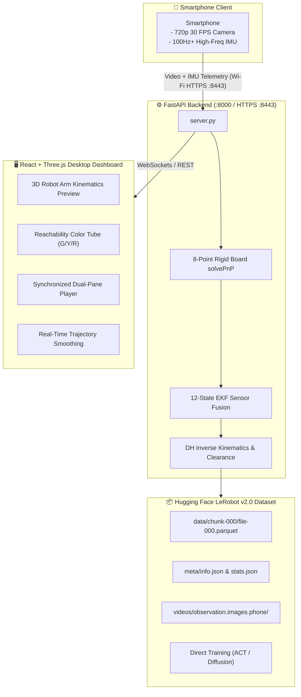
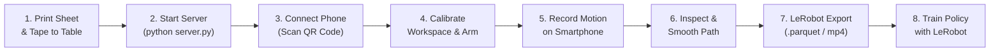
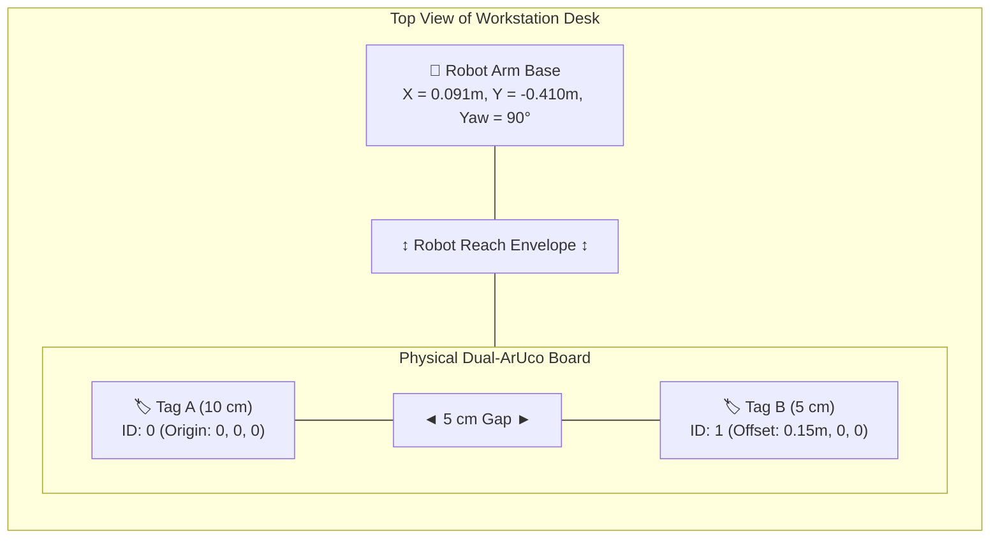
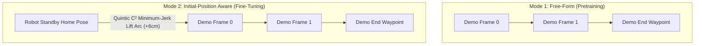

# OmniKin Mobile Dataset Collector 🦾📱

**A high-precision, low-cost robot demonstration collection framework powered by an everyday smartphone.** Capture 3D manipulation demonstrations using Dual-ArUco optical anchoring and IMU sensor fusion, visualize real-time robot arm kinematics, and export directly into [Hugging Face LeRobot](https://github.com/huggingface/lerobot) format for imitation learning (ACT, Diffusion Policy).



---

## 📑 Table of Contents

1. [Why OmniKin?](#-why-omnikin)
2. [Key Features](#-key-features)
3. [Hardware & Workspace Requirements](#-hardware--workspace-requirements)
4. [Software Installation & Setup](#-software-installation--setup)
5. [Step-by-Step Practical Usage Guide](#-step-by-step-practical-usage-guide)
   - [Step 1: Print & Prepare the Dual-ArUco Board](#step-1-print--prepare-the-dual-aruco-board)
   - [Step 2: Start the Backend Server](#step-2-start-the-backend-server)
   - [Step 3: Connect Your Smartphone via QR Code](#step-3-connect-your-smartphone-via-qr-code)
   - [Step 4: Configure Robot & Calibrate Workspace](#step-4-configure-robot--calibrate-workspace)
   - [Step 5: Record Demonstration Trajectories](#step-5-record-demonstration-trajectories)
   - [Step 6: Review, Filter & Smooth in Dashboard](#step-6-review-filter--smooth-in-dashboard)
   - [Step 7: Choose Trajectory Mode (Pretraining vs Fine-Tuning)](#step-7-choose-trajectory-mode)
   - [Step 8: Export to LeRobot Dataset Format](#step-8-export-to-lerobot-dataset-format)
   - [Step 9: Train Imitation Learning Policies](#step-9-train-imitation-learning-policies)
6. [Supported Robot Embodiments & Custom URDFs](#-supported-robot-embodiments--custom-urdfs)
7. [Kinematics & Safety Architecture](#-kinematics--safety-architecture)
8. [Dashboard Controls & Diagnostic Dev View](#-dashboard-controls--diagnostic-dev-view)
9. [Configuration File Reference (`robot_config.json`)](#-configuration-file-reference)
10. [API Reference](#-api-reference)
11. [Testing & Verification](#-testing--verification)
12. [Troubleshooting & FAQs](#-troubleshooting--faqs)

---

## 💡 Why OmniKin?

Collecting real-world robot manipulation demonstrations typically requires:
- Expensive teleoperation puppet arms ($3,000 – $10,000)
- Bulky VR controllers with external SteamVR base stations
- High-end optical motion capture rooms (Vicon/OptiTrack)

**OmniKin eliminates all specialized hardware.** By combining a standard sheet of paper printed with two ArUco markers and a smartphone you already own, OmniKin delivers **sub-millimeter 3D trajectory tracking**, transforms hand motion into collision-safe robot joint states, and exports clean, training-ready LeRobot datasets.

---

## ✨ Key Features

- 🎯 **8-Point Dual-ArUco Rigid Board PnP**: Combines Tag A (10 cm, origin) and Tag B (5 cm, offset) into an over-determined 8-corner geometry. Eliminates planar flipping ambiguities common in single-marker setups.
- 📐 **12-State Extended Kalman Filter (EKF)**: Fuses 30 FPS camera visual poses with 100 Hz+ phone IMU acceleration and angular velocity for drift-free, smooth 3D motion tracking.
- 🦾 **Universal Multi-Embodiment Support**: Out-of-the-box presets for **SO-ARM101-OMNI-KIN**, **SO-ARM101**, and **SO-ARM100**, plus instant upload and parsing for any custom 5–6 DOF URDF manipulator.
- 🛡️ **Universal Camera Mount Crash Prevention**: Computes 3D Euclidean clearance between phone camera and robot forearm link segment in real time. Automatically bounds wrist pitch $q_3$ to prevent damaging top-mounted camera brackets.
- 🔀 **Two Trajectory Modes**:
  - `free_form`: Unconstrained demonstrations starting at the first recorded frame (best for diverse pretraining).
  - `initial_aware`: Automatically calculates a quintic $C^2$ minimum-jerk approach path with a 6 cm parabolic lift arc connecting the robot standby home pose to the demonstration starting point (best for fine-tuning).
- 📊 **Synchronized Web Dashboard**:
  - Real-time Three.js 3D viewport showing the robot arm executing the demonstration.
  - Interactive reachability color coding (🟢 green = reachable, 🟡 yellow = near joint limits, 🔴 red = unreachable/collision).
  - Synchronized video playback with Picture-in-Picture (PiP), horizontal, and vertical split layouts.
  - Interactive Savitzky-Golay and Moving Average trajectory smoothing slider.
  - Diagnostic Dev View with ArUco 3D axes, OpenCV Canny edge monitor, and live telemetry.
- 📦 **Official LeRobot v2.0 Dataset Exporter**: Exports Parquet tables, MP4 video chunks, and JSON metadata (`info.json`, `stats.json`, `tasks.jsonl`, `episodes.jsonl`) fully compatible with Hugging Face `lerobot`.

---

## 🛠️ Hardware & Workspace Requirements

| Item | Requirement | Notes |
| :--- | :--- | :--- |
| **PC Workstation** | Windows 10/11 or Linux | Runs backend server and Three.js dashboard |
| **Smartphone** | iOS (Safari) or Android (Chrome) | Rear camera (720p 30fps) + IMU accelerometer/gyroscope |
| **Local Network** | Wi-Fi (same LAN) | PC and phone must be able to ping each other |
| **Printer** | Standard A4 printer | For printing the Dual-ArUco anchor sheet |
| **Robot Arm** | SO-100 / SO-101 / Custom | Optional for physical execution; virtual kinematics run in software |
| **Mounting / Grasp** | Handheld or 3D printed clamp | Hold the phone naturally or clamp it to an end-effector tool |

---

## 💻 Software Installation & Setup

### 1. Prerequisites

- [Miniconda](https://docs.conda.io/en/latest/miniconda.html) or Anaconda with Python 3.10
- [Node.js](https://nodejs.org/) v18+ and npm (for building the frontend)
- Git

### 2. Clone Repository & Setup Python Environment

```bash
# Clone the repository
git clone https://github.com/FalightSK/omni-kin.git
cd omni-kin

# Create and activate conda environment
conda create -n lerobot_collector python=3.10 -y
conda activate lerobot_collector

# Install Python dependencies
pip install -r requirements.txt
```

**`requirements.txt` dependencies:**
```text
fastapi>=0.100.0
uvicorn>=0.22.0
numpy>=1.24.0
scipy>=1.10.0
pandas>=2.0.0
pyarrow>=12.0.0
opencv-python>=4.8.0
jinja2>=3.1.0
python-multipart>=0.0.6
```

### 3. Build Desktop Frontend

The desktop dashboard is a modern React + Vite + Tailwind CSS application located in `frontend/`.

```bash
cd frontend
npm install
npm run build
cd ..
```

*Note: The pre-compiled assets in `frontend/dist/` are automatically served by `server.py` at `http://localhost:8000`.*

---

## 📖 Step-by-Step Practical Usage Guide

Follow this guide to set up your physical table, record your first episode, and export a dataset.



---

### Step 1: Print & Prepare the Dual-ArUco Board

The Dual-ArUco rigid board establishes the physical Cartesian world origin $(0, 0, 0)$ for all trajectories.

1. Turn on your printer with standard A4 paper.
2. Open `http://localhost:8000/api/marker/print_dual` in your desktop browser.
3. In your browser's Print dialog:
   - **Destination**: Your printer (or Save to PDF)
   - **Layout**: Landscape
   - **Scale**: **100% (Actual Size)** — *Do NOT select "Fit to Printable Area"*
4. Measure the printed sheet with a physical ruler to verify accuracy:
   - **Tag A (ID 0)**: Exactly $10.0\text{ cm} \times 10.0\text{ cm}$
   - **Tag B (ID 1)**: Exactly $5.0\text{ cm} \times 5.0\text{ cm}$
   - **Gap between Tag A and Tag B**: Exactly $5.0\text{ cm}$ (Tag B origin at $X = 0.15\text{ m}$)
5. Tape the printed sheet flat onto your table with clear tape so it cannot slide.



---

### Step 2: Start the Backend Server

Run `server.py` in your conda environment:

```bash
conda activate lerobot_collector
python server.py
```

Console output will display:
```text
=================================================================
 OmniKin 3D Trajectory Dataset Collector Server Started!
=================================================================
 Desktop Dashboard (HTTP):  http://localhost:8000
 📱 Mobile Logger  (HTTPS): https://192.168.1.50:8443/mobile
 📱 Mobile Logger  (HTTP):  http://192.168.1.50:8000/mobile
 Print ArUco Marker:        http://localhost:8000/api/marker/print_dual
 Mobile QR Code:            http://localhost:8000/api/mobile/qr

 [!] HTTPS Active on Port 8443 (Self-Signed SSL for Camera/IMU):
     When opening on your mobile browser, tap:
     - Android Chrome: 'Advanced' -> 'Proceed to 192.168.1.50 (unsafe)'
     - iOS Safari:     'Show Details' -> 'visit this website' -> 'Visit Website'
=================================================================
```

> **Why HTTPS on port 8443?** Modern mobile browsers (iOS Safari, Android Chrome) block camera access (`getUserMedia`) and motion sensor events (`DeviceMotionEvent`) over unencrypted HTTP. The server automatically spins up a background SSL daemon on port 8443 using pre-generated certificates (`cert.pem` / `key.pem`).

---

### Step 3: Connect Your Smartphone via QR Code

1. On your desktop, open `http://localhost:8000`.
2. Click the purple **"📱 Connect Phone"** button in the top navigation bar.
3. A modal appears displaying a large QR code pointing to `https://<YOUR_LAN_IP>:8443/mobile`.
4. Open your smartphone camera app and scan the QR code.
5. **Accept the One-Time Self-Signed SSL Warning**:
   - **Android Chrome**: Tap **"Advanced"** ➔ **"Proceed to `<IP>` (unsafe)"**.
   - **iOS Safari**: Tap **"Show Details"** ➔ **"visit this website"** ➔ confirm **"Visit Website"**.
6. When prompted, tap **"Allow"** to grant camera and motion sensor permissions.
7. Rotate your phone to **Landscape** orientation.

---

### Step 4: Configure Robot & Calibrate Workspace

Click the **"⚙️ Robot Setup"** button in the desktop dashboard navigation bar to open the configuration dialog.

#### 1. Embodiment Tab
- Choose your robot preset from the dropdown:
  - `SO-ARM101-OMNI-KIN` *(Default)*
  - `SO-ARM101`
  - `SO-ARM100`
- *Or upload your own custom URDF*: Click **"Upload URDF"** to drag-and-drop any `.urdf` file. The server automatically parses links, joints, limits, and builds the DH kinematic table.

#### 2. Workspace Calibration Tab
Calibrates where the physical robot base sits relative to the ArUco marker origin $(0, 0, 0)$:
- `Offset X (m)`: Default `0.091` (lateral table offset)
- `Offset Y (m)`: Default `-0.410` (forward distance in front of marker)
- `Offset Z (m)`: Default `0.000` (table surface level)
- `Yaw (deg)`: Default `90.0°` (robot facing towards the marker board)
- **Auto-Alignment**:
  - Click **"Recommended"** to center the workspace based on the arm's reach envelope.
  - Click **"Optimal"** to perform least-squares fitting against previously recorded trajectories.

#### 3. Camera / Gripper Offset Tab
Defines the translation and rotation from the robot gripper Tool Center Point (TCP) to the phone camera lens:
- `Forward (cm)`: `12.8`
- `Height (cm)`: `10.9`
- `Lateral (cm)`: `0.0`
- `Pitch (deg)`: `40.4°`

#### 4. Wrist Safety ($q_3$ Crash Prevention) Tab
- `q3_safe_max_deg`: Max upward pitch limit (default: `5.0°`).
- Prevents the camera bracket from rotating backwards into the robot forearm link during manipulation.
- Downward flexion for picking up objects from the floor ($-20^\circ \dots -60^\circ$) remains completely unconstrained.

#### 5. Initial Position Tab
- Defines the canonical standby/home pose $[X, Y, Z, \text{Roll}, \text{Pitch}, \text{Yaw}, \text{Gripper}]$ used by `initial_aware` mode.
- Defaults: $X = 0.15\text{ m}, Y = 0.00\text{ m}, Z = 0.20\text{ m}, \text{Gripper} = 100\%$.

Click **"Save Configuration"**. Settings are persisted to `robot_config.json`.

---

### Step 5: Record Demonstration Trajectories

1. On your phone screen, tap the green **"START CAMERA & IMU"** button.
2. Aim the rear camera at the printed Dual-ArUco sheet from a comfortable distance ($25\text{ cm} – 50\text{ cm}$).
3. Verify that the HUD shows active IMU readings and that the green bounding box locks onto the markers.
4. Tap the red **"START RECORDING"** button.
5. Move your phone smoothly to perform the demonstration task (e.g., reaching toward an object, grasping, lifting, and placing).
6. Tap **"STOP RECORDING"**.
7. The phone automatically compresses the video and sends it alongside the high-rate IMU telemetry to the server. Within 2–3 seconds, the new episode appears in the desktop dashboard.

---

### Step 6: Review, Filter & Smooth in Dashboard

In the desktop dashboard (`http://localhost:8000`):

1. **Synchronized Playback**:
   - Scrub the master timeline slider or click **"Play"** (Spacebar) to inspect the 3D trajectory and recorded camera video simultaneously.
2. **Reachability Color Diagnostics**:
   - **🟢 Green**: Waypoint fully within physical robot arm reach; IK solved with high margin.
   - **🟡 Yellow**: Waypoint approaching joint limits or high-torque wrist extension.
   - **🔴 Red**: Waypoint unreachable or in violation of camera collision clearance.
3. **Reactive Trajectory Smoothing**:
   - Adjust the **Smoothing Window** slider ($50\text{ ms} – 500\text{ ms}$) in the right sidebar.
   - Switch between **Savitzky-Golay** (preserves acceleration peaks) and **Moving Average** (maximizes smoothness).
   - The 3D spline and joint angles re-calculate interactively.
4. **Dev View Diagnostic Overlay**:
   - Click **"Dev View"** to toggle between Raw Video, ArUco 3D Coordinate Axes Overlay (+X Red, +Y Green, +Z Blue), and OpenCV Canny Edge Detection.
5. **Quality Control**:
   - If a demonstration had tracking glitches or an accidental drop, click **"Delete Episode"** to purge it before exporting.

---

### Step 7: Choose Trajectory Mode

In the export panel on the desktop dashboard, select your desired trajectory paradigm:



| Mode | Key in API | Characteristics | When to Use |
| :--- | :--- | :--- | :--- |
| **Free-Form** | `free_form` | Trajectory starts immediately from the human's first hand motion. No added approach path. | Pretraining foundation models; capturing unstructured human demonstrations. |
| **Initial-Position Aware** | `initial_aware` | Automatically prepends a smooth $C^2$ minimum-jerk approach path (~45 frames) starting from `initial_position` with a 6 cm parabolic clearance lift arc. | Fine-tuning policies on physical robots requiring predictable start/docking positions. |

---

### Step 8: Export to LeRobot Dataset Format

1. In the episode table, check the boxes for the episodes you wish to include (or click **"Select All"**).
2. Enter your dataset name (e.g., `pick_apple_omnikin_v1`).
3. Select the **Trajectory Mode** (`free_form` or `initial_aware`).
4. Click **"📦 Export LeRobot Dataset"**.
5. The dataset is exported under `lerobot_exports/<dataset_name>/`.

#### Exported Directory Structure
```
lerobot_exports/pick_apple_omnikin_v1/
├── data/
│   └── chunk-000/
│       └── file-000.parquet               <-- Full tabular data (states, poses, actions)
├── meta/
│   ├── info.json                          <-- LeRobot schema, FPS, dynamic DH joint names
│   ├── stats.json                         <-- Mean, std, min, max per feature
│   ├── tasks.jsonl                        <-- Task mapping
│   ├── episodes.jsonl                     <-- Episode index, duration, frame counts
│   └── episodes/
│       └── file-000.parquet
└── videos/
    └── observation.images.phone/
        └── chunk-000/
            ├── episode_000000.mp4         <-- Transcoded demonstration video
            ├── episode_000001.mp4
            └── ...
```

#### Parquet Dataset Schema
| Column | Dtype | Description |
| :--- | :--- | :--- |
| `index` | `int64` | Global monotonic frame index across all episodes |
| `episode_index` | `int64` | 0-based sequential episode index |
| `frame_index` | `int64` | Frame index within the episode (resets to 0 for each episode) |
| `timestamp` | `float32` | Elapsed time in seconds from episode start |
| `next.done` | `bool` | `True` only on the terminal frame of an episode; `False` otherwise |
| `task_index` | `int64` | Numerical task identifier corresponding to `meta/tasks.jsonl` |
| `task` | `string` | Natural language task description (e.g. `"reach to object"`) |
| `observation.state` | `float32[N]` | Robot joint angles in degrees + gripper percentage `[0, 100]` |
| `observation.ee_pose` | `float32[6]` | 6-DOF Cartesian pose `[x, y, z, roll, pitch, yaw]` in robot base frame |
| `action` | `float32[N]` | Next-frame target joint angles ($\mathbf{a}_t = \mathbf{q}_{t+1}$, last frame copies $\mathbf{q}_T$) |

*Note: $N$ matches the number of revolute joints plus 1 for the gripper. Joint names in `info.json` are dynamically loaded from your active URDF/DH table.*

---

### Step 9: Train Imitation Learning Policies

You can directly pass the exported dataset into the official [Hugging Face LeRobot](https://github.com/huggingface/lerobot) training pipeline.

```bash
# Clone official LeRobot repository
git clone https://github.com/huggingface/lerobot.git
cd lerobot
pip install -e .

# Train an Action Chunking Transformer (ACT) policy
python lerobot/scripts/train.py \
    --dataset_path ../mobile_dataset_collector/lerobot_exports/pick_apple_omnikin_v1 \
    --policy act \
    --env so100 \
    --batch_size 16 \
    --num_workers 4 \
    --training_steps 100000
```

To train a Diffusion Policy:
```bash
python lerobot/scripts/train.py \
    --dataset_path ../mobile_dataset_collector/lerobot_exports/pick_apple_omnikin_v1 \
    --policy diffusion \
    --env so100
```

---

## 🤖 Supported Robot Embodiments & Custom URDFs

OmniKin comes pre-configured with the following manipulators:

| Preset Identifier | Robot Name | DOF | Default Wrist Joint | Reach | Payload |
| :--- | :--- | :--- | :--- | :--- | :--- |
| `so_arm101_omni_kin` | **SO-ARM101-OMNI-KIN** *(Default)* | 5 + Gripper | Joint 3 (`wrist_pitch_joint`) | 38.5 cm | 500 g |
| `so101` | **SO-ARM101** | 5 + Gripper | Joint 3 (`q3_wrist_pitch`) | 38.5 cm | 500 g |
| `so100` | **SO-ARM100** | 5 + Gripper | Joint 3 (`q3_wrist_pitch`) | 35.0 cm | 400 g |
| `custom` | **Uploaded URDF** | 5–6 + Gripper | *Auto-detected dynamically* | *Auto* | *Auto* |

### Uploading a Custom Robot URDF
1. Click **"Robot Setup"** in the top navbar.
2. In the **Embodiment** tab, click **"Upload URDF"**.
3. Select your `.urdf` file.
4. The system automatically:
   - Identifies the kinematic chain from base link to end-effector flange.
   - Computes standard Denavit-Hartenberg (DH) parameters ($d, a, \alpha, \theta$).
   - Dynamically discovers the wrist pitch joint using semantic token matching (`wrist`, `pitch`, `flex`, `tilt`).
   - Determines joint limit ranges and maps them to the 3D visualizer and IK engine.

---

## 📐 Kinematics & Safety Architecture

### 1. Dual-ArUco Over-Determined PnP

Rather than tracking a single marker, OmniKin treats the 8 corners of Tag A and Tag B as a single rigid body:

$$
\mathbf{P}_{\text{world}} = \begin{bmatrix} \mathbf{C}_A^{(0)} & \mathbf{C}_A^{(1)} & \mathbf{C}_A^{(2)} & \mathbf{C}_A^{(3)} & \mathbf{C}_B^{(0)} & \mathbf{C}_B^{(1)} & \mathbf{C}_B^{(2)} & \mathbf{C}_B^{(3)} \end{bmatrix} \in \mathbb{R}^{3 \times 8}
$$

This over-determined system is solved via Levenberg-Marquardt optimization (`cv2.solvePnP` with iterative refinement), completely eliminating planar axis flips when the camera approaches normal incidence.

### 2. Universal 3D Euclidean Clearance Invariant
To guarantee that the top-mounted phone camera never collides with the robot forearm link, the solver enforces an analytic point-to-segment distance check:

$$
t^* = \operatorname{clip}\left(\frac{(\mathbf{p}_{\text{cam}} - \mathbf{p}_{\text{elbow}}) \cdot (\mathbf{p}_{\text{wrist}} - \mathbf{p}_{\text{elbow}})}{\|\mathbf{p}_{\text{wrist}} - \mathbf{p}_{\text{elbow}}\|^2}, 0, 1\right)
$$

$$
\mathbf{p}_{\text{closest}} = \mathbf{p}_{\text{elbow}} + t^* (\mathbf{p}_{\text{wrist}} - \mathbf{p}_{\text{elbow}})
$$

$$
d_{\text{clearance}} = \|\mathbf{p}_{\text{cam}} - \mathbf{p}_{\text{closest}}\|
$$

- If $d_{\text{clearance}} < 0.045\text{ m}$ ($4.5\text{ cm}$), the configuration is heavily penalized and clamped.
- **Coordinate-Frame Agnostic**: This mathematical invariant is 100% independent of joint index numbers, axis signs, or mounting brackets.

---

## 🖥️ Dashboard Controls & Diagnostic Dev View

### Master Viewport Layouts
Use the layout buttons in the upper-right corner of the dashboard:
- **PiP (Picture-in-Picture)** *(Default)*: Full-screen 3D Three.js trajectory viewport with a floating video monitor anchored in the bottom-right corner.
- **Vertical Split**: Side-by-side 50/50 dual-pane display with draggable splitter bar.
- **Horizontal Split**: Stacked 3D viewport above the video player.

### Dev View Vision Monitor
Toggle the **"Dev View"** button to access computer vision diagnostics:
- **ArUco Diagnostic Overlay**: Renders detected 2D corner circles, Corner 0 origin indicators, tag ID badges, and 3D coordinate frame axes directly over the live canvas.
- **OpenCV Canny Edge View**: Displays high-contrast edge gradients used by the feature tracking backend.
- **Telemetry HUD**: Displays real-time 3D tracking error ($\text{cm}$), visual velocity ($\text{m/s}$), and EKF covariance health.

---

## ⚙️ Configuration File Reference

All calibration parameters are saved in `robot_config.json`:

```json
{
  "robot_type": "so_arm101_omni_kin",
  "offset_x": 0.091,
  "offset_y": -0.410,
  "offset_z": 0.000,
  "yaw_deg": 90.0,
  "q3_safe_max_deg": 5.0,
  "gripper_offset": {
    "forward_cm": 12.8,
    "height_cm": 10.9,
    "lateral_cm": 0.0,
    "pitch_deg": 40.4,
    "roll_deg": 0.0,
    "yaw_deg": 0.0,
    "enabled": true
  },
  "initial_position": {
    "x": 0.15,
    "y": 0.00,
    "z": 0.20,
    "pitch_deg": 0.0,
    "roll_deg": 0.0,
    "yaw_deg": 0.0,
    "gripper": 100.0,
    "enabled": true
  }
}
```

---

## 📡 API Reference

The FastAPI backend exposes the following REST endpoints:

### Robot Configuration & Calibration
| Method | Endpoint | Description |
| :--- | :--- | :--- |
| `GET` | `/api/robot/config` | Returns current embodiment, DH table, workspace calibration, and wrist safety index |
| `POST` | `/api/robot/config` | Updates robot type, workspace offsets ($X, Y, Z, \text{Yaw}$), and safety limits |
| `GET` | `/api/robot/initial_position` | Returns the canonical standby/home pose configuration |
| `POST` | `/api/robot/initial_position` | Updates the standby/home pose for `initial_aware` mode |
| `POST` | `/api/robot/gripper_offset` | Updates camera-to-gripper extrinsic translation and rotation |
| `POST` | `/api/upload_urdf` | Uploads and parses a custom robot URDF XML |
| `POST` | `/api/robot/solve_ik` | Solves inverse kinematics for arbitrary 6-DOF Cartesian poses |

### Episode Management & Recording
| Method | Endpoint | Description |
| :--- | :--- | :--- |
| `GET` | `/api/episodes` | Returns a list of all recorded demonstration episodes |
| `POST` | `/api/recordings/save` | Multipart upload for mobile phone video + IMU telemetry |
| `POST` | `/api/recordings/sample` | Generates a synthetic 3D demonstration path for testing |
| `DELETE`| `/api/episodes/{id}` | Deletes a specific episode and its video files from disk |
| `POST` | `/api/episodes/clear` | Purges all recorded episodes |

### Trajectory Planning & Dataset Export
| Method | Endpoint | Description |
| :--- | :--- | :--- |
| `POST` | `/api/trajectory/plan_approach` | Generates a quintic minimum-jerk approach path connecting home to start waypoint |
| `POST` | `/api/export_lerobot` | Exports selected episodes into Hugging Face LeRobot format |

### Diagnostic Utilities
| Method | Endpoint | Description |
| :--- | :--- | :--- |
| `GET` | `/api/mobile/qr` | Generates an SVG QR code pointing to the phone logger HTTPS URL |
| `GET` | `/api/marker/print_dual` | Dedicated 1:1 physical scale printable A4 HTML sheet |
| `GET` | `/api/marker/image` | Returns high-resolution ArUco marker image |

---

## 🧪 Testing & Verification

Execute the test suite to verify pipeline functionality:

```bash
# Test 1: ArUco 8-point PnP & 12-state EKF fusion pipeline
python test_aruco_pipeline.py

# Test 2: Multi-embodiment robot kinematics and 3D clearance safety
python test_robot_kinematics.py

# Test 3: URDF parser and DH parameter generator
python test_urdf_converter.py

# Test 4: End-to-end LeRobot dataset exporter
python test_pipeline.py
```

All test scripts verify mathematical invariants, joint bounds, and schema conformance.

---

## ❓ Troubleshooting & FAQs

### 1. The phone shows a "Connection refused" or cannot open the page
- Ensure your phone and PC are connected to the **same local Wi-Fi network**.
- Check Windows Firewall: ensure Python is allowed to accept incoming connections on ports `8000` and `8443`.
- Verify that your PC has not changed its local IP address (run `ipconfig` on Windows or `ifconfig` on Linux).

### 2. Camera or motion sensors are blocked on mobile browser
- Mobile browsers strictly prohibit sensor access on plain HTTP over LAN.
- Ensure you opened the **HTTPS** address (`https://<IP>:8443/mobile`).
- On iOS Safari: navigate to **Settings > Safari > Motion & Orientation Access** and ensure it is turned **ON**.

### 3. ArUco markers are not detected or jump randomly
- Verify that your printout is at **100% scale** (Tag A must measure exactly $10.0\text{ cm}$, Tag B exactly $5.0\text{ cm}$).
- Avoid direct glare from overhead fluorescent lamps on the paper surface; use diffuse lighting.
- Ensure the phone camera lens is clean and unobstructed.

### 4. Trajectory displays red segments in the 3D viewer
- Red indicates that the desired waypoint is outside the arm's physical reach envelope, or causes a camera mount collision.
- In **Robot Setup > Workspace Calibration**, click **"Recommended"** or adjust `offset_y` so the table workspace is comfortably within reach of the robot base.

---

## 📄 License

This project is licensed under the [MIT License](LICENSE).
